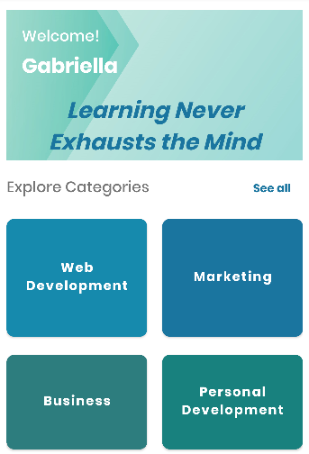

  </a>

  <h3 align="center">Online Teaching - A1 Courses </h3>

## Description

This project was done for a university course (Android Development & Software Eng)

* The concept of using mobile learning is to make learning more interesting and not monotonous.
As we live in a digital era, people nowadays cannot get away from technology that easily, for that the online teaching platform named A1 Courses that is implemented in mobile devices (Android), made it a great way to connect people with technology and create a positive impact to their lives as well as a support to the flexibility in both teaching and learning.
* The mobile learning app is an application that consists of two elements: a server that performs the base functionality and a user interface that is run by instructors and students. 
* In this application students can learn in an interactive way and study at their own pace. Students can access whatever they want to learn through the computer or their smartphones. Thus, the learning process can be done anywhere and anytime.
* The purpose of our application is designed to provide a learning environment to students by giving a variety of courses that they could enroll to, that covers various topics and also has a way to assess a student’s progress or achievement by taking quizzes. And the ability given to instructors to add a new course with a single click, or easily upload a file of information for students.

## Getting Started

### Screens

### Technical environment used

* PHP
* Database: MYSQL
* Android programming: Java
* Xampp

## Authors

Contributors names

* [Gabriella Shebly](https://beacons.ai/gabz.edu)
* Jamil Al Masry

## Acknowledgments

Inspiration, code snippets, etc.
* [Advanced-HttpURLConnection](https://github.com/VishnuSivadasVS/Advanced-HttpURLConnection)
* [uclone](https://github.com/koushil-mankali/uclone)

(<a href="#top">back to top</a>)

